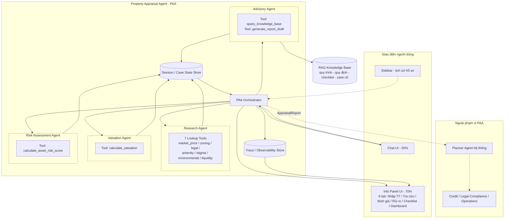
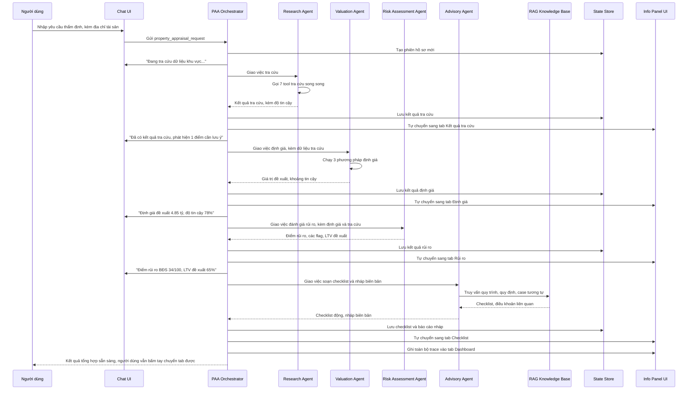

# Kiến trúc High-Level — Property Appraisal Agent (PAA)

Tài liệu này mô tả kiến trúc ở mức tổng quan (agents, tools, knowledge base, data store) cần có để vận hành đúng nghiệp vụ đã thể hiện trong mockup: chat hội thoại 30% + panel thông tin 70% với 6 tab (Nhập thông tin, Kết quả tra cứu, Định giá, Rủi ro, Checklist, Dashboard).

**Phạm vi:** chỉ kiến trúc nội bộ của PAA. Planner Agent hệ thống và các digital expert agent khác (Credit, Legal/Compliance, Operations) chỉ xuất hiện như actor bên ngoài, không thiết kế chi tiết ở đây — giữ đúng phạm vi đã thống nhất từ tài liệu thiết kế trước.

---

## 1. Các thành phần chính

Để một yêu cầu chat của người dùng đi hết luồng nghiệp vụ (tra cứu → định giá → rủi ro → checklist/báo cáo) và đồng bộ ra cả Chat UI lẫn Info Panel, PAA được chia thành **1 orchestrator + 4 agent chuyên trách**, mỗi agent sở hữu tool riêng — đúng tinh thần "planner–executor, mỗi agent là 1 chuyên gia số" của đề bài, nhưng thu nhỏ trong phạm vi 1 module.

| Thành phần | Vai trò | Tool sở hữu |
|---|---|---|
| **PAA Orchestrator** | Nhận yêu cầu từ Chat UI, điều phối tuần tự/song song 4 agent chuyên trách, ghi state, đẩy cập nhật ra Chat UI + Info Panel + Dashboard theo thời gian thực (đúng hành vi "agent tự chuyển tab" đã chốt) | — (không gọi tool trực tiếp, chỉ điều phối) |
| **Research Agent** (Agent Tra cứu) | Gom toàn bộ dữ liệu khu vực & tài sản, chạy song song để tối ưu thời gian | 7 lookup tool: `market_price_lookup`, `planning_zoning_lookup`, `legal_status_lookup`, `neighborhood_amenity_lookup`, `stigma_reputation_lookup`, `environmental_risk_lookup`, `liquidity_stat_lookup` |
| **Valuation Agent** (Agent Định giá) | Nhận dữ liệu tra cứu, tính giá trị đề xuất kèm khoảng tin cậy | `calculate_valuation` (so sánh trực tiếp + hedonic/ML + chi phí xây dựng) |
| **Risk Assessment Agent** (Agent Đánh giá rủi ro) | Nhận dữ liệu tra cứu + kết quả định giá, tính điểm rủi ro bất động sản và đề xuất LTV | `calculate_asset_risk_score` |
| **Advisory Agent** (Agent Cố vấn & Soạn thảo) | Sinh checklist theo loại tài sản, soạn nháp biên bản thẩm định, trả lời Q&A tự do của thẩm định viên trong chat | `query_knowledge_base`, `generate_report_draft` |

**Knowledge Base (RAG):** kho tri thức vector hoá gồm quy trình thẩm định nội bộ, quy định pháp luật liên quan, checklist theo loại hình BĐS, và các case đã thẩm định trước — chỉ Advisory Agent truy vấn.

**Session / Case State Store:** lưu toàn bộ state của 1 phiên thẩm định (input ban đầu, kết quả từng bước) — là nguồn dữ liệu chung để Chat UI và Info Panel luôn đồng bộ, đồng thời backing cho danh sách "Lịch sử hồ sơ" ở sidebar.

**Trace / Observability Store:** ghi lại mọi hành động, thời điểm, input/output của từng agent — nguồn dữ liệu cho tab Dashboard (đúng yêu cầu "dashboard hiển thị agent trace" của đề bài).

---

## 2. Sơ đồ kiến trúc (high-level)

---

## 3. Sequence diagram (high-level) — input người dùng đi qua agent, tool, knowledge base

---

## 4. Vì sao chia thành 4 agent thay vì 1 agent gọi 9 tool

- **Song song hoá đúng chỗ:** Research Agent có thể chạy 7 tool tra cứu song song ngay từ đầu; Valuation/Risk/Advisory phải chạy tuần tự vì phụ thuộc dữ liệu của bước trước — tách agent giúp orchestrator kiểm soát rõ ràng thứ tự & phụ thuộc này.
- **Đồng bộ tab tự nhiên:** mỗi agent hoàn tất tương ứng đúng 1 tab trên Info Panel (Research → tab 2, Valuation → tab 3, Risk → tab 4, Advisory → tab 5) — orchestrator chỉ cần "agent nào xong thì chuyển tab đó", logic rất tường minh.
- **Dễ mở rộng & demo tách biệt:** mỗi agent test được độc lập (mock input/output), và khi ghép vào hệ thống multi-agent lớn hơn của SHB (Credit, Legal...), toàn bộ 4 agent này vẫn đóng gói gọn trong 1 "PAA" duy nhất — bên ngoài chỉ thấy 1 interface request/response như đã thiết kế trước.
