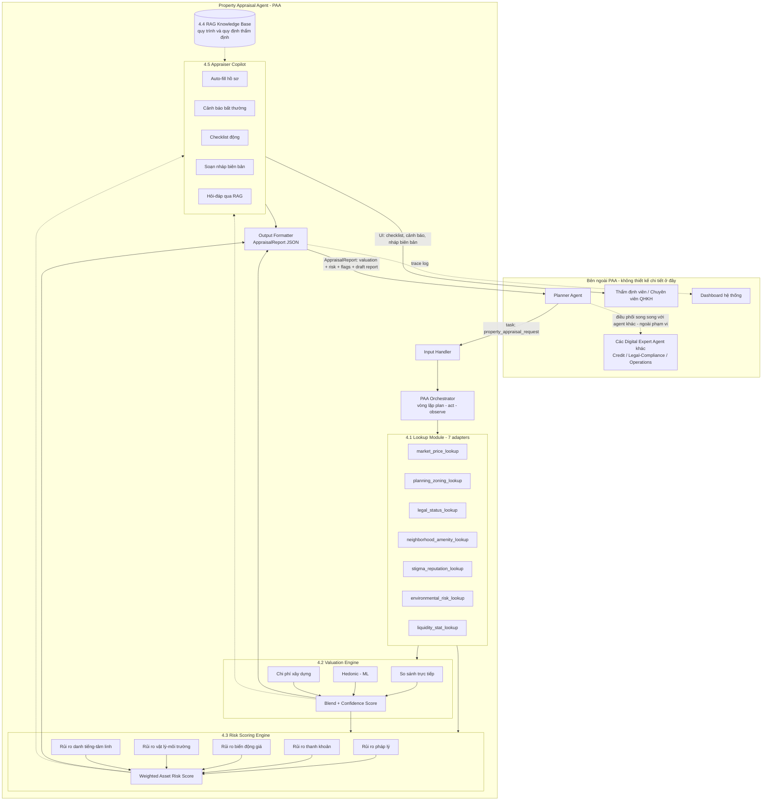
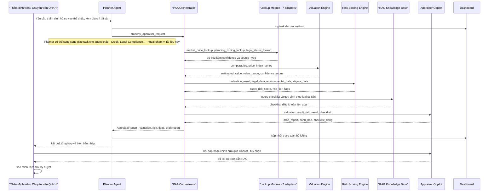

# Module Thẩm Định Bất Động Sản (Property Appraisal Digital Expert Agent)

**Tài liệu thiết kế — Vietnam AI Innovation Challenge 2026 / Hack CX Together**
**Đề bài:** *Digital Expert Agents – A Team of AI Specialists for Banking Operations* (SHB)
**Phạm vi tài liệu:** thiết kế **chi tiết kiến trúc nội bộ của riêng Property Appraisal Agent (PAA)** — các module bên trong, cách chúng tương tác với nhau, và các điểm giao tiếp (interface) với Planner Agent cùng người dùng. Các agent chuyên gia khác trong hệ thống (Credit, Legal/Compliance, Operations...) **không được thiết kế chi tiết ở đây** — chúng chỉ xuất hiện như các actor bên ngoài, giao tiếp với PAA qua interface chuẩn (request/response), để tài liệu tập trung tối đa vào PAA.

---

## 1. Tổng quan

Đề bài SHB yêu cầu một hệ thống multi-agent gồm các "chuyên gia số" (Credit, Legal/Compliance, Operations...) do một **Planner Agent** điều phối, biết dùng tool, truy vấn RAG, và **thực hiện hành động** thay vì chỉ trả lời văn bản. Module này hiện thực hoá một trong các chuyên gia đó: **Agent Thẩm Định Bất Động Sản (Property Appraisal Agent — gọi tắt PAA)**.

PAA đóng vai trò như một thẩm định viên số, được **Planner Agent** triệu gọi mỗi khi có hồ sơ tín dụng có tài sản bảo đảm là nhà/đất (ai gọi Planner, hay Planner phối hợp thêm với agent nào khác, nằm ngoài phạm vi tài liệu này). Nhiệm vụ của PAA:

1. **Định giá** tài sản bảo đảm dựa trên dữ liệu giao dịch khu vực xung quanh (theo thời gian).
2. **Tra cứu & tổng hợp thông tin** liên quan đến tài sản — tốt (tiện ích, hạ tầng, quy hoạch thuận lợi) lẫn xấu (tranh chấp, ngập úng, quy hoạch treo, tin đồn tâm linh...).
3. **Đưa ra khuyến nghị** thẩm định (giá trị đề xuất, mức độ tin cậy, các điểm cần thẩm định viên con người kiểm tra thêm).
4. **Đánh giá rủi ro của chính bất động sản** (pháp lý, thanh khoản, biến động giá, vật lý/môi trường, danh tiếng — không phải rủi ro tài chính của người vay) — PAA trả kết quả này ra ngoài qua interface chuẩn để lớp ra quyết định tín dụng (nằm ngoài phạm vi tài liệu) sử dụng.
5. **Tối ưu công việc của nhân viên thẩm định thực tế**: cung cấp base knowledge (quy trình, quy định nội bộ, checklist pháp lý) qua RAG, tự động điền hồ sơ, soạn nháp biên bản thẩm định, cảnh báo bất thường.

---

## 2. Kiến trúc nội bộ PAA & các điểm tương tác (interfaces)

PAA không thay thế thẩm định viên — nó là **executor agent chuyên biệt**, nhận task từ Planner Agent, tự chạy toàn bộ pipeline nội bộ (tra cứu → định giá → chấm điểm rủi ro → tra RAG → soạn nháp báo cáo), rồi trả kết quả có cấu trúc ra ngoài. Sơ đồ dưới đây đi sâu vào **bên trong PAA**; các agent khác (Credit, Legal/Compliance, Operations...) chỉ được vẽ như một khối gộp ở ngoài biên, thể hiện rằng chúng tồn tại và tiêu thụ output của PAA — **không thiết kế chi tiết nội bộ của chúng** trong tài liệu này.



**Cách đọc sơ đồ:**
- Khối `PAA` là toàn bộ phạm vi thiết kế của tài liệu này — mọi module con (Lookup, Valuation, Risk Scoring, RAG, Copilot, Output Formatter) đều được đặc tả chi tiết ở mục 4.
- Khối `EXT` chỉ là các điểm chạm bên ngoài: Planner gửi task vào và nhận `AppraisalReport` ra; thẩm định viên tương tác với Copilot qua UI; Dashboard nhận trace để hiển thị; các agent chuyên gia khác (Credit/Legal/Operations) chỉ được gộp chung thành `OTH` vì chúng tiêu thụ output của PAA nhưng không thuộc phạm vi thiết kế.
- Nhờ tách bạch input/output rõ ràng (`property_appraisal_request` vào, `AppraisalReport` ra), PAA có thể được phát triển, test và demo **độc lập**, chỉ cần mock phía Planner/Credit khi tích hợp — không phải chờ các agent kia được xây xong.

---

## 3. Mục tiêu & phạm vi

### Trong phạm vi MVP (demo hackathon)
- Định giá 1 bất động sản (nhà mặt phố / nhà trong hẻm / đất nền — ưu tiên nhà ở đô thị) dựa trên mock data giao dịch khu vực.
- Tra cứu thông tin "tốt/xấu/tâm linh" từ mock knowledge base có cấu trúc.
- Sinh điểm đánh giá rủi ro bất động sản + đề xuất LTV.
- Soạn nháp biên bản thẩm định + gợi ý checklist cho thẩm định viên.
- Hiển thị trace/luồng xử lý trên dashboard chung của hệ thống.

### Ngoài phạm vi MVP (định hướng mở rộng)
- Kết nối dữ liệu thật (Sở TN&MT, cổng quy hoạch, các trang rao bán BĐS, dữ liệu nội bộ SHB).
- Định giá bằng ảnh vệ tinh / computer vision cho hiện trạng công trình.
- Tự động cập nhật mô hình định giá theo dữ liệu giao dịch mới (continual learning).

---

## 4. Kiến trúc chi tiết các thành phần

### 4.1 Lookup / Tra cứu Module

Vai trò: gom toàn bộ thông tin liên quan đến tài sản và khu vực xung quanh, đóng vai trò "tools" mà PAA gọi qua function calling. Thiết kế theo **adapter pattern** để sau này thay mock bằng nguồn thật mà không đổi interface.

| Adapter | Trả về | Nguồn mock (demo) | Nguồn thật (tương lai) |
|---|---|---|---|
| `market_price_lookup` | Giao dịch/rao bán so sánh trong bán kính N km, theo mốc thời gian | Bộ dữ liệu JSON mô phỏng giá theo phường/quận theo quý, 2020–2026 | Trang rao bán BĐS, dữ liệu nội bộ SHB, Sở Xây dựng |
| `planning_zoning_lookup` | Quy hoạch, chỉ giới, tình trạng quy hoạch treo | Mock theo mã thửa/khu vực | Cổng thông tin quy hoạch địa phương |
| `legal_status_lookup` | Sổ đỏ/sổ hồng, tranh chấp, thế chấp trước đó | Mock hồ sơ pháp lý | CIC, dữ liệu nội bộ, văn phòng đăng ký đất đai |
| `neighborhood_amenity_lookup` | Trường học, bệnh viện, chợ, giao thông, an ninh khu vực | Mock POI theo bán kính | Google Places / OSM |
| `stigma_reputation_lookup` | Tin tức xấu, tai nạn/án mạng, tâm linh, tranh chấp cộng đồng, tin đồn | Mock "hồ sơ dư luận khu vực" gán theo địa chỉ | Tin tức, mạng xã hội, dữ liệu khảo sát dân cư (cần kiểm chứng & cảnh báo độ tin cậy) |
| `environmental_risk_lookup` | Ngập úng, sạt lở, ô nhiễm, gần nghĩa trang/khu công nghiệp | Mock theo khu vực | Dữ liệu khí tượng thuỷ văn, cảnh báo thiên tai |
| `liquidity_stat_lookup` | Thời gian bán trung bình, tỷ lệ giao dịch thành công khu vực | Mock thống kê | Dữ liệu sàn giao dịch BĐS |

> Toàn bộ adapter trả kết quả kèm **`confidence`** (0–1) và **`source_type`** (`mock` / `verified` / `unverified_rumor`) để Risk Scoring Engine và Copilot xử lý minh bạch — đặc biệt với nhóm "tâm linh/tin đồn", tuyệt đối không được trộn lẫn với dữ kiện pháp lý đã xác thực.

### 4.2 Valuation Engine (Định giá)

Kết hợp 3 phương pháp thẩm định giá phổ biến trong thực tế ngân hàng, có trọng số:

1. **So sánh trực tiếp (Comparable/Sales Comparison Approach — trọng số chính):**
   - Lấy N giao dịch/tin rao bán gần nhất trong bán kính & khung thời gian.
   - Điều chỉnh theo: diện tích, mặt tiền/hẻm, hướng nhà, số tầng, tuổi công trình, tình trạng pháp lý, thời điểm giao dịch (quy đổi về thời điểm hiện tại bằng **chỉ số biến động giá khu vực** — "giá theo các mốc thời gian" mà bạn nêu).
   - Công thức điều chỉnh giá theo thời gian: `giá_quy_đổi = giá_giao_dịch × (chỉ_số_giá[kỳ_hiện_tại] / chỉ_số_giá[kỳ_giao_dịch])`.

2. **Mô hình hồi quy/hedonic (ML-assisted):**
   - Feature: vị trí (lat/long, khoảng cách trục đường chính), diện tích, mặt tiền, số tầng, tuổi nhà, pháp lý, mật độ tiện ích xung quanh, điểm "stigma" (mục 4.3).
   - Dùng để làm mượt/kiểm chứng chéo với phương pháp so sánh, đặc biệt khi ít giao dịch so sánh.

3. **Phương pháp chi phí (Cost Approach — bổ trợ):**
   - Giá trị đất (theo so sánh) + giá trị xây dựng còn lại (đơn giá xây dựng × diện tích sàn × hệ số khấu hao theo tuổi công trình).

**Kết quả đầu ra:**
```json
{
  "estimated_value": 4850000000,
  "value_range": {"low": 4550000000, "high": 5100000000},
  "value_per_m2": 97000000,
  "confidence_score": 0.78,
  "methodology_breakdown": {
    "comparable_approach": 4900000000,
    "hedonic_model": 4800000000,
    "cost_approach": 4750000000
  },
  "comparables_used": 6,
  "time_adjustment_index_period": "2026-Q2",
  "adjustment_notes": ["giá quy đổi theo chỉ số Q2/2026", "trừ 4% do hẻm 2.5m", "cộng 3% do gần trường học"]
}
```

### 4.3 Risk Scoring Engine (Đánh giá rủi ro Bất động sản)

Đây là phần trả lời trực tiếp yêu cầu "đánh giá rủi ro việc cấp tín dụng cho tài sản đó" — nhưng đặt trọng tâm vào **rủi ro nội tại của chính bất động sản** (pháp lý, thanh khoản, biến động giá, vật lý/môi trường, danh tiếng), **tách biệt với** rủi ro tín dụng/tài chính của người vay (do Credit Agent xử lý riêng). Điểm rủi ro BĐS này sau đó là một trong các input để Credit Agent tổng hợp ra quyết định cấp tín dụng cuối cùng. Risk score tổng hợp từ các nhóm rủi ro sau, mỗi nhóm có điểm 0–100 và trọng số:

| Nhóm rủi ro | Trọng số | Yếu tố đầu vào |
|---|---|---|
| Rủi ro pháp lý | 30% | Sổ đỏ/hồng hợp lệ, tranh chấp, đang thế chấp nơi khác, quy hoạch treo |
| Rủi ro thanh khoản | 25% | Thời gian bán trung bình khu vực, tỷ lệ giao dịch thành công, độ hot của phân khúc |
| Rủi ro biến động giá | 20% | Độ lệch chuẩn giá khu vực theo lịch sử, xu hướng tăng/giảm gần đây |
| Rủi ro vật lý/môi trường | 15% | Ngập úng, sạt lở, ô nhiễm, chất lượng công trình |
| Rủi ro danh tiếng/tâm linh | 10% | Tin đồn, sự kiện tiêu cực từng xảy ra — **luôn gắn nhãn độ tin cậy thấp/chưa xác thực**, chỉ dùng để cảnh báo tham khảo, không dùng làm căn cứ pháp lý từ chối hồ sơ |

**Output:**
```json
{
  "asset_risk_score": 34,
  "risk_tier": "MEDIUM",
  "recommended_ltv_cap": 0.65,
  "flags": [
    {"type": "legal", "severity": "low", "detail": "Sổ hồng hợp lệ, không tranh chấp ghi nhận", "confidence": 0.95},
    {"type": "stigma", "severity": "medium", "detail": "Có tin đồn dân cư chưa xác thực về sự kiện năm 2019", "confidence": 0.35, "action": "cần thẩm định viên xác minh thực địa"}
  ],
  "recommended_conditions": ["Yêu cầu khảo sát thực địa xác minh tranh chấp lân cận", "Mua bảo hiểm tài sản do khu vực từng ghi nhận ngập nhẹ"]
}
```

> Nguyên tắc thiết kế quan trọng: **các yếu tố chưa xác thực (tin đồn, tâm linh) không được tự động khoá hồ sơ**, chỉ tạo flag yêu cầu con người xác minh — tránh rủi ro pháp lý/đạo đức khi từ chối tín dụng dựa trên tin đồn.

### 4.4 RAG Knowledge Base cho thẩm định viên

Kho tri thức nội bộ (mock cho demo, dùng vector store) gồm:
- Quy trình thẩm định tài sản bảo đảm nội bộ SHB (các bước, biểu mẫu).
- Quy định pháp luật liên quan (Luật Đất đai, Luật Nhà ở, quy định LTV theo loại tài sản).
- Checklist rủi ro theo loại hình BĐS (nhà phố, đất nền, chung cư, BĐS thương mại).
- Best practice / các case đã thẩm định trước đây (tình huống tương tự → khuyến nghị đã áp dụng).

PAA truy vấn RAG này khi: (a) sinh checklist cho thẩm định viên, (b) trả lời câu hỏi tình huống ("tài sản đang thế chấp nơi khác thì xử lý sao?"), (c) đảm bảo biên bản thẩm định tuân thủ đúng biểu mẫu quy định.

### 4.5 Appraiser Copilot (giao diện hỗ trợ nhân viên thẩm định)

Đây là lớp "tối ưu hoá công việc nhân viên thẩm định" mà bạn nhấn mạnh — không thay thế con người mà tăng tốc & giảm sai sót:

- **Auto-fill hồ sơ**: điền sẵn dữ liệu so sánh, tra cứu tự động khi nhập địa chỉ.
- **Cảnh báo bất thường**: nếu giá đề xuất của thẩm định viên lệch >X% so với giá mô hình → cảnh báo kèm giải thích.
- **Checklist động**: sinh checklist theo loại tài sản + các flag rủi ro phát hiện được (dựa trên RAG + risk engine).
- **Soạn nháp biên bản thẩm định**: PAA tạo bản nháp đầy đủ (xem mục 6), thẩm định viên chỉnh sửa & ký duyệt cuối cùng.
- **Hỏi-đáp tức thời**: thẩm định viên hỏi trực tiếp PAA về quy định/case tương tự qua chat, có trích dẫn nguồn RAG.

---

## 5. Mock Data Schema

### 5.1 Giao dịch/so sánh khu vực theo thời gian
```json
{
  "transaction_id": "TXN-000123",
  "address": "Hẻm 45 Nguyễn Văn A, Phường B, Quận C",
  "lat": 10.7756, "long": 106.7019,
  "area_m2": 60,
  "frontage_m": 4,
  "alley_width_m": 3.5,
  "floors": 3,
  "legal_status": "so_hong",
  "transaction_type": "sold",
  "price_total": 4600000000,
  "price_per_m2": 76666667,
  "transaction_date": "2025-11-10",
  "distance_from_subject_km": 0.6
}
```

### 5.2 Chỉ số giá khu vực theo thời gian (dùng để quy đổi)
```json
{
  "ward": "Phường B, Quận C",
  "series": [
    {"period": "2024-Q1", "index": 100.0},
    {"period": "2024-Q4", "index": 106.2},
    {"period": "2025-Q4", "index": 114.8},
    {"period": "2026-Q2", "index": 118.3}
  ]
}
```

### 5.3 Hồ sơ "tốt/xấu/tâm linh" theo địa chỉ
```json
{
  "address_id": "ADDR-88291",
  "positive_factors": [
    {"type": "amenity", "detail": "Cách trường tiểu học đạt chuẩn 300m", "confidence": 0.9},
    {"type": "infrastructure", "detail": "Sắp thông tuyến đường nội bộ theo quy hoạch đã duyệt", "confidence": 0.8}
  ],
  "negative_factors": [
    {"type": "environmental", "detail": "Từng ghi nhận ngập nhẹ mùa mưa 2022–2023", "confidence": 0.7},
    {"type": "legal", "detail": "Một phần thửa đất nằm trong lộ giới quy hoạch", "confidence": 0.85}
  ],
  "stigma_factors": [
    {"type": "rumor", "detail": "Dư luận khu vực đồn về sự việc không rõ nguồn năm 2019", "confidence": 0.3, "verified": false}
  ]
}
```

---

## 6. Output: Biên bản thẩm định (nháp tự động)

PAA sinh bản nháp theo cấu trúc chuẩn để thẩm định viên rà soát:

1. Thông tin tài sản & chủ sở hữu
2. Phương pháp định giá áp dụng & kết quả (mục 4.2)
3. Danh sách bất động sản so sánh (kèm nguồn, độ tin cậy)
4. Các yếu tố tích cực / tiêu cực / cần xác minh thêm
5. Điểm rủi ro tài sản & đề xuất LTV/điều kiện cấp tín dụng (mục 4.3)
6. Checklist còn thiếu cần thẩm định viên bổ sung tại hiện trường
7. Chữ ký & xác nhận của thẩm định viên (con người luôn là bước duyệt cuối)

---

## 7. Luồng xử lý end-to-end (sequence diagram)



---

## 8. Tool / Function-calling Spec

```yaml
tools:
  - name: market_price_lookup
    description: Tra cứu giao dịch/tin rao bán BĐS so sánh trong bán kính và khung thời gian cho trước.
    parameters: {address, lat, long, radius_km, period_from, period_to, property_type}

  - name: planning_zoning_lookup
    description: Tra cứu tình trạng quy hoạch, lộ giới, quy hoạch treo của thửa đất.
    parameters: {address, cadastral_id}

  - name: legal_status_lookup
    description: Tra cứu tình trạng pháp lý, tranh chấp, thế chấp hiện có.
    parameters: {address, owner_id}

  - name: neighborhood_amenity_lookup
    description: Tra cứu tiện ích, hạ tầng xung quanh trong bán kính cho trước.
    parameters: {lat, long, radius_km}

  - name: stigma_reputation_lookup
    description: Tra cứu tin tức/dư luận tiêu cực, yếu tố tâm linh — luôn trả kèm confidence & verified flag.
    parameters: {address}

  - name: environmental_risk_lookup
    description: Tra cứu rủi ro ngập úng, sạt lở, ô nhiễm khu vực.
    parameters: {lat, long}

  - name: calculate_valuation
    description: Chạy Valuation Engine trên dữ liệu đã thu thập, trả về giá trị đề xuất + độ tin cậy.
    parameters: {subject_property, comparables, price_index_series}

  - name: calculate_asset_risk_score
    description: Chạy Risk Scoring Engine, trả về điểm rủi ro, tier, LTV đề xuất, flags.
    parameters: {valuation_result, legal_data, environmental_data, liquidity_data, stigma_data}

  - name: query_appraisal_knowledge_base
    description: Truy vấn RAG kiến thức quy trình/quy định thẩm định nội bộ.
    parameters: {query, property_type}

  - name: generate_appraisal_report_draft
    description: Sinh bản nháp biên bản thẩm định theo biểu mẫu chuẩn.
    parameters: {subject_property, valuation_result, risk_result, kb_checklist}
```

### Ví dụ system prompt — Property Appraisal Agent

```
Bạn là Agent Thẩm Định Bất Động Sản của SHB, một chuyên gia số hỗ trợ thẩm định viên con người.
Nhiệm vụ: thu thập dữ liệu qua tool, định giá tài sản, đánh giá rủi ro bất động sản,
và soạn nháp biên bản thẩm định. Con người luôn là người quyết định cuối cùng.

Nguyên tắc bắt buộc:
1. Luôn gọi tool để lấy dữ liệu thực tế trước khi kết luận — không tự suy đoán số liệu.
2. Với mọi thông tin thuộc nhóm "tin đồn/tâm linh/chưa xác thực", PHẢI gắn nhãn confidence thấp
   và verified=false, không dùng làm căn cứ chính để từ chối hồ sơ.
3. Luôn trình bày rõ phương pháp định giá và các điều chỉnh đã áp dụng (giải thích được - explainable).
4. Khi thiếu dữ liệu hoặc độ tin cậy thấp, chủ động flag "cần thẩm định viên xác minh thực địa"
   thay vì đưa ra kết luận chắc chắn.
5. Trả kết quả có cấu trúc (JSON) để Planner Agent và Credit Agent có thể tổng hợp tự động.
```

### Interface contract của PAA (input/output) — để tích hợp mà không cần thiết kế Planner/Credit/Legal

Đây là hợp đồng giao tiếp PAA expose ra ngoài. Bất kỳ agent nào (Planner thật, hoặc một script test/mocked caller) chỉ cần tuân theo schema này là gọi được PAA độc lập.

**Input — `property_appraisal_request`:**
```json
{
  "request_id": "REQ-2026-0001",
  "subject_property": {
    "address": "Hẻm 45 Nguyễn Văn A, Phường B, Quận C",
    "lat": 10.7756, "long": 106.7019,
    "area_m2": 62,
    "property_type": "nha_pho",
    "legal_status_claimed": "so_hong"
  },
  "loan_context": {
    "requested_amount": 3200000000,
    "purpose": "the_chap_vay_von"
  }
}
```

**Output — `AppraisalReport` (trả về cho caller, vd. Planner hoặc test harness):**
```json
{
  "request_id": "REQ-2026-0001",
  "valuation": { "...": "xem cấu trúc mục 4.2" },
  "asset_risk": { "...": "xem cấu trúc mục 4.3" },
  "checklist": ["..."],
  "draft_report_url": "reports/REQ-2026-0001.md",
  "requires_human_verification": true,
  "trace_id": "TRACE-8891"
}
```

> Vì input/output được chuẩn hoá, đội phát triển PAA có thể tự viết một **mock Planner** đơn giản (chỉ gửi JSON request và in ra response) để demo/test toàn bộ pipeline PAA mà không cần chờ Credit/Legal/Operations Agent được xây dựng.

---

## 9. Công nghệ đề xuất (khớp với đề bài)

| Lớp | Công nghệ |
|---|---|
| Reasoning engine | Claude / GPT-4 (qua API) |
| Agent framework | LangGraph (khuyến nghị cho planner–executor rõ ràng) hoặc CrewAI |
| Tool/function calling | Native function calling của LLM, chuẩn hoá qua MCP nếu tích hợp nhiều nguồn dữ liệu |
| RAG | Vector store (Chroma/FAISS cho demo) + embedding, tách namespace theo agent |
| Backend | FastAPI, expose từng tool như 1 endpoint + orchestration endpoint |
| Mock data layer | JSON/SQLite mô phỏng, thiết kế adapter interface để thay bằng nguồn thật sau này |
| Dashboard | React, hiển thị trace/task status nội bộ của PAA (lookup → valuation → risk → copilot); điểm tích hợp với agent khác chỉ cần 1 log entry, không cần dashboard thiết kế riêng cho họ |
| State/memory | Lưu theo session hồ sơ vay (giữ ngữ cảnh giữa các agent trong 1 luồng xét duyệt) |

---

## 10. Roadmap MVP cho hackathon

**Giai đoạn 1 — Nền tảng (ưu tiên cao nhất):**
- Xây mock data (giao dịch, chỉ số giá, hồ sơ tốt/xấu/tâm linh) cho 1–2 khu vực mẫu.
- Lookup adapters (mock) + Valuation Engine (comparable approach trước, hedonic sau nếu còn thời gian).
- Risk Scoring Engine cơ bản (pháp lý + thanh khoản + biến động giá).

**Giai đoạn 2 — Đóng gói interface & tự-test:**
- Expose PAA qua API chuẩn theo interface contract (mục 8): nhận `property_appraisal_request`, trả `AppraisalReport`.
- Viết một **mock Planner** tối giản (script gửi request mẫu, in kết quả) để test/demo toàn bộ pipeline PAA độc lập — không cần chờ Credit/Legal/Operations Agent.
- Sinh trace log nội bộ hiển thị trên dashboard.

**Giai đoạn 3 — Trải nghiệm & thuyết phục demo:**
- Appraiser Copilot: sinh nháp biên bản thẩm định, checklist, cảnh báo bất thường.
- RAG knowledge base cho câu hỏi tình huống thẩm định viên.
- So sánh hiệu năng single-agent chatbot vs. multi-agent hành động (đúng yêu cầu deliverable cuối của đề bài).

**Nếu còn thời gian (stretch goals):**
- Adapter tra cứu web thật (fallback khi mock không đủ) cho 1–2 nguồn tiêu biểu.
- Mô hình hedonic ML đơn giản (regression) thay vì rule-based.
- Cảnh báo rủi ro tập trung tài sản thế chấp cùng khu vực (portfolio-level).

---

## 11. Giới hạn & lưu ý đạo đức/tuân thủ

- **Không dùng yếu tố tâm linh/tin đồn chưa xác thực làm căn cứ từ chối tín dụng** — chỉ dùng để cảnh báo, luôn có audit trail giải thích được.
- Toàn bộ quyết định cuối cùng thuộc về con người (thẩm định viên/chuyên viên tín dụng); PAA chỉ đề xuất.
- Cần disclaimer rõ ràng khi dùng dữ liệu mock trong demo, tránh gây hiểu lầm là số liệu thật.
- Giá trị định giá cần đi kèm khoảng tin cậy (range), không chỉ 1 con số tuyệt đối, để tránh false precision.
