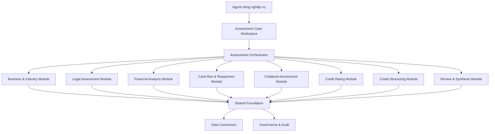
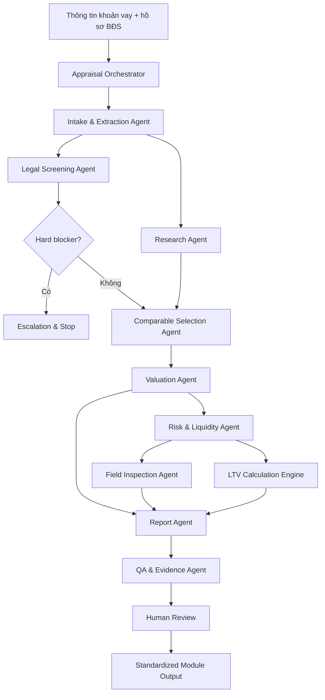

# KIẾN TRÚC HỆ THỐNG AI MODULAR CHO CÔNG ĐOẠN THẨM ĐỊNH TÍN DỤNG SME

## 0. Mục đích tài liệu

Tài liệu này mô tả một hệ thống AI dạng module chỉ tập trung vào **công đoạn thẩm định tín dụng SME** trong quy trình cấp tín dụng của ngân hàng.

Phạm vi hệ thống không bao gồm toàn bộ hành trình từ tiếp nhận đến giải ngân và giám sát sau vay. Thay vào đó, hệ thống tập trung giải quyết sâu các nghiệp vụ cốt lõi của công đoạn thẩm định, bao gồm:

- Thẩm định mô hình kinh doanh và ngành.
- Thẩm định pháp lý doanh nghiệp.
- Phân tích tài chính.
- Phân tích dòng tiền và khả năng trả nợ.
- Thẩm định tài sản bảo đảm.
- Xếp hạng tín dụng.
- Cấu trúc phương án cấp tín dụng.
- Phản biện, kiểm tra và tổng hợp kết quả thẩm định.

Mỗi nhóm nghiệp vụ được xây dựng thành một **module độc lập**. Một module có thể:

- Hoạt động riêng lẻ.
- Được tích hợp vào hệ thống LOS hoặc workflow hiện có.
- Kết hợp với các module khác để tạo thành một hệ thống thẩm định SME hoàn chỉnh.
- Bao gồm nhiều agent chuyên biệt bên trong.
- Được cập nhật độc lập khi dữ liệu, chính sách hoặc mô hình thay đổi.
- Được thay thế mà không phải xây lại toàn bộ nền tảng.

Trong phạm vi hackathon 48 giờ, đội thi xây dựng:

> **MVP: Module Thẩm định Bất động sản bảo đảm**, là một module hoàn chỉnh trong hệ thống thẩm định tín dụng SME.

---

# 1. Bối cảnh và pain point

Ngân hàng đã có nhiều hệ thống hỗ trợ số hóa, lưu trữ hồ sơ, tính toán và quản lý quy trình. Vấn đề còn lại không phải là “mọi thứ đều làm thủ công”, mà là các bước thẩm định vẫn bị phân mảnh, phụ thuộc nhiều vào cách mỗi chuyên viên tìm kiếm, đối chiếu, đánh giá và tổng hợp thông tin.

## Các pain point cốt lõi

- **Dữ liệu thẩm định nằm ở nhiều hệ thống và nguồn khác nhau**, nên chuyên viên vẫn phải tự gom, đối chiếu và xác định đâu là dữ liệu đáng tin cậy trước khi đưa ra kết luận.

- **Kết quả tự động hóa hiện có thường dừng ở mức trích xuất hoặc tính toán**, chưa kết nối thành một luồng phân tích hoàn chỉnh từ dữ liệu đầu vào đến nhận định, cảnh báo, phương án xử lý và evidence.

- **Cùng một hồ sơ có thể cho ra nhận định khác nhau giữa các chuyên viên**, do cách chọn nguồn, cách đánh giá rủi ro và mức độ phụ thuộc vào kinh nghiệm cá nhân chưa được chuẩn hóa đầy đủ.

- **Các mâu thuẫn giữa BCTC, thuế, hóa đơn, sao kê, hợp đồng và dữ liệu vận hành thường được phát hiện muộn**, khiến hồ sơ phải bổ sung, giải trình hoặc làm lại nhiều vòng.

- **Phân tích SME không thể chỉ dựa vào BCTC**, nhưng việc kết hợp dòng tiền thực, mô hình kinh doanh, ngành, khách hàng, nhà cung cấp, người liên quan và yếu tố phi tài chính vẫn tốn nhiều thời gian và khó đồng nhất.

- **Kiểm tra pháp lý doanh nghiệp vẫn cần đọc nhiều tài liệu và đối chiếu theo từng trường hợp**, đặc biệt với thẩm quyền ký, điều lệ, nghị quyết, giấy phép và các ngoại lệ pháp lý.

- **Trong thẩm định bất động sản, chuyên viên vẫn phải tự tìm dữ liệu thị trường trên nhiều nguồn rồi đi thực địa**, dẫn đến tốn thời gian, dễ bị ảnh hưởng bởi nguồn tin không đồng đều, thiên kiến khi chọn tài sản so sánh và sai lệch trong điều chỉnh giá.

- **Định giá tài sản mới chỉ trả lời “tài sản đáng giá bao nhiêu”**, trong khi ngân hàng còn phải đánh giá khả năng thanh khoản, rủi ro pháp lý, quy hoạch, ngập, môi trường, khả năng xử lý tài sản và tác động đến LTV.

- **Các kết quả từ từng nhóm thẩm định chưa luôn được tái sử dụng trực tiếp cho bước tiếp theo**, nên số liệu và nhận định có thể phải nhập lại, viết lại hoặc kiểm tra lại khi lập phương án tín dụng và trình phê duyệt.

- **Khi chính sách, dữ liệu thị trường hoặc mô hình thay đổi, việc cập nhật một hệ thống lớn dễ ảnh hưởng nhiều chức năng khác**, khiến ngân hàng khó kiểm thử, thay thế và triển khai nâng cấp theo từng năng lực.

- **Kết luận AI hoặc nhận định tự động khó được tin tưởng nếu không truy ngược được nguồn, phép tính, policy version và người xác nhận**, đặc biệt trong môi trường tín dụng có yêu cầu kiểm toán và trách nhiệm cao.

- **AI không thể thay thế hoàn toàn chuyên gia và hoạt động thực địa**, nên hệ thống cần tập trung chỉ đúng điểm bất thường, đúng bằng chứng cần kiểm tra và đúng trường hợp phải chuyển sang con người.

# 2. Động lực xây dựng dự án

Dự án được xây dựng để giải quyết bốn nhu cầu cốt lõi:

## 2.1. Chuẩn hóa

Biến kinh nghiệm thẩm định thành:

- Checklist.
- Rule.
- Calculation.
- Workflow.
- Agent task.
- Evidence requirement.
- Human review point.

## 2.2. Tái sử dụng

Một kết quả được tạo ra ở module trước có thể được dùng lại ở module sau.

Ví dụ:

```text
Dữ liệu doanh thu đã xác minh
→ dùng cho Financial Analysis
→ dùng cho Cash-flow Analysis
→ dùng cho Credit Rating
→ dùng cho Credit Structuring
→ dùng cho Approval Summary
```

## 2.3. Scale up

Ngân hàng có thể:

- Triển khai trước một module có ROI cao.
- Mở rộng dần theo phòng ban.
- Mở rộng theo loại khoản vay.
- Mở rộng theo loại TSBĐ.
- Mở rộng theo chi nhánh.
- Không cần thay toàn bộ hệ thống hiện tại.

## 2.4. Dễ cập nhật khi dữ liệu thay đổi

Khi dữ liệu hoặc policy thay đổi, ngân hàng chỉ cần cập nhật module liên quan.

Ví dụ:

- Giá BĐS thay đổi → cập nhật Research và Valuation Module.
- Policy LTV thay đổi → cập nhật LTV Rule Engine.
- Scorecard thay đổi → cập nhật Credit Rating Module.
- Quy định pháp lý thay đổi → cập nhật Legal Knowledge Base.
- Nguồn dữ liệu mới xuất hiện → cập nhật Data Connector.

---

# 3. Phạm vi hệ thống

## 3.1. Hệ thống chỉ tập trung vào công đoạn thẩm định

Vị trí trong quy trình tín dụng:

```text
Khách hàng
→ Tiếp nhận
→ Thu thập hồ sơ
→ [THẨM ĐỊNH TÍN DỤNG SME]
→ Tuân thủ và rủi ro
→ Lập tờ trình
→ Phê duyệt
→ Hoàn thiện pháp lý
→ Giải ngân
→ Giám sát sau vay
```

Hệ thống nhận đầu vào từ công đoạn thu thập hồ sơ và trả kết quả cho:

- Lập tờ trình.
- Checker.
- Cấp phê duyệt.
- Các module tuân thủ và rủi ro.
- Giám sát sau vay khi cần tái thẩm định.

## 3.2. Các nhóm module chính

```text
SME CREDIT ASSESSMENT PLATFORM
│
├── 1. Business & Industry Assessment
├── 2. Legal Assessment
├── 3. Financial Analysis
├── 4. Cash-flow & Repayment Capacity
├── 5. Collateral Assessment
├── 6. Credit Rating
├── 7. Credit Structuring
└── 8. Cross-module Review & Synthesis
```

## 3.3. Các lớp dùng chung

```text
Shared Foundation
├── Case Context
├── Document Intelligence
├── Entity Intelligence
├── Policy & Knowledge Retrieval
├── Calculation Engine
├── Evidence Graph
├── Module Orchestrator
├── QA & Validation
├── Human Review
├── Audit Log
└── Model & Data Registry
```

---

# 4. Nguyên tắc kiến trúc

## 4.1. Mỗi module giải quyết một nhóm năng lực rõ ràng

Ví dụ:

- Financial Analysis không tự quyết định giá trị TSBĐ.
- Collateral Assessment không tự chấm credit rating.
- Credit Rating không tự viết lại dữ liệu tài chính.
- Credit Structuring không tự thay đổi chính sách.
- Cross-module Review không tự phê duyệt khoản vay.

## 4.2. Module có thể là một hệ thống multi-agent

Một module phức tạp có thể gồm:

- Orchestrator Agent.
- Extraction Agent.
- Research Agent.
- Calculation Engine.
- Analysis Agent.
- Anomaly Agent.
- Policy Agent.
- Challenge Agent.
- Report Agent.
- QA Agent.

## 4.3. Không phải mọi thành phần đều là LLM

| Thành phần | Công nghệ phù hợp |
|---|---|
| OCR và document extraction | OCR/Vision model |
| Phân loại tài liệu | Classification model |
| Dự báo dòng tiền | Statistical/ML model |
| Tính DSCR, LTV | Calculation engine |
| Kiểm tra policy | Rule engine |
| Tra cứu knowledge | RAG/Search |
| Soạn nhận xét | LLM |
| Phát hiện bất thường | Anomaly detection |
| Điều phối | Workflow orchestrator |
| Quyết định cuối cùng | Con người |

## 4.4. Module giao tiếp qua output contract chuẩn

Mọi module trả về:

- Findings.
- Metrics.
- Risk flags.
- Confidence.
- Evidence.
- Assumptions.
- Policy references.
- Human review status.
- Module version.
- Data version.

## 4.5. Mỗi module có vòng đời cập nhật độc lập

Mỗi module cần có:

- Model registry.
- Data source registry.
- Rule version.
- Prompt version.
- Test cases.
- Backtest dataset.
- Performance threshold.
- Rollback version.
- Change log.

---

# 5. Kiến trúc tổng thể của hệ thống thẩm định



---

# 6. Người dùng theo từng module

| Module | Người dùng chính | Người nhận kết quả |
|---|---|---|
| Business & Industry | Chuyên viên tín dụng, RM | Maker, Checker |
| Legal Assessment | Chuyên viên pháp lý, tín dụng | Maker, Checker |
| Financial Analysis | Chuyên viên phân tích tín dụng | Maker, Credit Rating |
| Cash-flow & Repayment | Chuyên viên tín dụng | Maker, Credit Structuring |
| Collateral Assessment | Chuyên viên định giá | Maker, Checker, Approver |
| Credit Rating | Chuyên viên tín dụng, Risk | Maker, Checker |
| Credit Structuring | Maker, chuyên viên tín dụng | Checker, Approver |
| Review & Synthesis | Checker, Underwriter | Approver |

Người dùng không cần truy cập toàn bộ hệ thống. Mỗi người chỉ sử dụng module phù hợp với vai trò và quyền hạn.

---

# 7. Chi tiết các module trong hệ thống thẩm định

---

## 7.1. Module Business & Industry Assessment

### Mục tiêu

Hiểu doanh nghiệp thực sự vận hành như thế nào và các yếu tố phi tài chính nào có thể ảnh hưởng đến khả năng trả nợ.

### Người dùng

- RM.
- Chuyên viên tín dụng.
- Chuyên viên phân tích ngành.
- Maker.
- Checker.

### Input

- Hồ sơ doanh nghiệp.
- Website.
- Mô tả hoạt động.
- Hợp đồng đầu ra, đầu vào.
- Danh sách khách hàng, nhà cung cấp.
- Dữ liệu ngành.
- Dữ liệu thị trường.
- Phỏng vấn khách hàng.
- Dữ liệu lịch sử quan hệ ngân hàng.

### Hệ thống agent bên trong

#### Business Profile Agent

- Tóm tắt mô hình kinh doanh.
- Xác định sản phẩm, dịch vụ.
- Xác định kênh bán.
- Xác định nguồn thu.
- Xác định cấu trúc chi phí.
- Xác định chuỗi giá trị.

#### Industry Research Agent

- Tra cứu ngành.
- Phân tích quy mô và xu hướng.
- Phân tích rủi ro vĩ mô.
- Phân tích yếu tố pháp lý.
- Phân tích tính chu kỳ.
- Phân tích mức độ cạnh tranh.

#### Customer Concentration Agent

- Phân tích tỷ trọng doanh thu theo khách hàng.
- Phát hiện phụ thuộc vào khách hàng lớn.
- Phân tích thời hạn hợp đồng.
- Phân tích khả năng thay thế.

#### Supplier Concentration Agent

- Phân tích mức phụ thuộc nhà cung cấp.
- Phân tích rủi ro nguồn nguyên liệu.
- Phân tích biến động giá.
- Phân tích rủi ro nhập khẩu.

#### Seasonality Agent

- Phân tích doanh thu theo thời gian.
- Phân tích nhu cầu vốn theo mùa.
- Phát hiện thời điểm dòng tiền căng thẳng.

#### Key-person Dependency Agent

- Xác định mức phụ thuộc vào chủ doanh nghiệp.
- Phân tích cơ cấu quản trị.
- Phân tích kế hoạch kế nhiệm.
- Gắn cờ rủi ro quản trị.

#### External Risk Agent

- Theo dõi tin tức.
- Theo dõi kiện tụng.
- Theo dõi thay đổi giấy phép.
- Theo dõi sự kiện ảnh hưởng hoạt động.

#### Business QA Agent

- Kiểm tra kết luận có evidence.
- Phân biệt fact và inference.
- Phát hiện nhận định thiếu dữ liệu.

### Output

- Business profile.
- Industry risk score.
- Customer concentration.
- Supplier concentration.
- Seasonality findings.
- Key-person risk.
- External risk.
- Business assumptions.
- Questions cần xác minh.

---

## 7.2. Module Legal Assessment

### Mục tiêu

Đánh giá tư cách pháp lý, thẩm quyền và các điều kiện pháp lý liên quan đến khoản vay.

### Người dùng

- Chuyên viên pháp lý.
- Chuyên viên tín dụng.
- Maker.
- Checker.

### Input

- Đăng ký doanh nghiệp.
- Điều lệ.
- Quyết định bổ nhiệm.
- Nghị quyết.
- Biên bản họp.
- Giấy tờ người đại diện.
- Giấy phép chuyên ngành.
- Hợp đồng.
- Cơ cấu sở hữu.

### Hệ thống agent bên trong

#### Legal Document Extraction Agent

- Trích xuất pháp nhân.
- Trích xuất ngành nghề.
- Trích xuất người đại diện.
- Trích xuất vốn điều lệ.
- Trích xuất cơ cấu thành viên.
- Trích xuất điều khoản về thẩm quyền vay.

#### Entity Status Agent

- Kiểm tra tình trạng pháp nhân.
- Kiểm tra mã số thuế.
- Kiểm tra tình trạng hoạt động.
- Phát hiện thay đổi đăng ký gần đây.

#### Signatory Authority Agent

- So sánh người ký với đăng ký doanh nghiệp.
- Kiểm tra ủy quyền.
- Kiểm tra thời hạn ủy quyền.
- Kiểm tra phạm vi quyền hạn.

#### Corporate Approval Agent

- Đọc điều lệ.
- Xác định cấp cần phê duyệt.
- Kiểm tra nghị quyết hoặc biên bản.
- Phát hiện khoản vay vượt thẩm quyền.

#### License & Business Scope Agent

- Kiểm tra ngành nghề.
- Kiểm tra giấy phép có điều kiện.
- Kiểm tra mục đích vay có phù hợp hoạt động hợp pháp.

#### Legal Conflict Agent

- Đối chiếu nhiều tài liệu.
- Phát hiện tên, địa chỉ, người đại diện hoặc vốn không thống nhất.
- Phát hiện tài liệu hết hạn.

#### Legal Knowledge Agent

- Tra cứu quy định.
- Kiểm tra version.
- Trích dẫn căn cứ.
- Không tự thay thế ý kiến pháp lý chính thức.

#### Legal QA Agent

- Kiểm tra finding có căn cứ.
- Kiểm tra trích dẫn.
- Gắn confidence.
- Xác định điểm cần luật sư hoặc cán bộ review.

### Output

- Legal status.
- Signatory status.
- Corporate approval status.
- License findings.
- Legal blockers.
- Required documents.
- Legal exceptions.
- Evidence.

---

## 7.3. Module Financial Analysis

### Mục tiêu

Chuẩn hóa và phân tích tình hình tài chính lịch sử của SME.

### Người dùng

- Chuyên viên phân tích tín dụng.
- Maker.
- Checker.
- Risk.

### Input

- BCTC.
- Sổ chi tiết.
- Tờ khai thuế.
- Dữ liệu kế toán.
- Dữ liệu lịch sử.
- Ghi chú BCTC.
- Báo cáo kiểm toán nếu có.

### Hệ thống agent bên trong

#### Financial Statement Extraction Agent

- Trích xuất bảng cân đối kế toán.
- Trích xuất kết quả kinh doanh.
- Trích xuất lưu chuyển tiền tệ.
- Mapping tài khoản.
- Gắn evidence đến từng dòng.

#### Financial Normalization Agent

- Chuẩn hóa tên chỉ tiêu.
- Chuẩn hóa kỳ báo cáo.
- Chuẩn hóa đơn vị tiền.
- Loại dữ liệu trùng.
- Xử lý thay đổi cách hạch toán.

#### Financial Calculation Engine

Tính:

- Tăng trưởng doanh thu.
- Biên lợi nhuận.
- ROA.
- ROE.
- Current ratio.
- Quick ratio.
- Debt/equity.
- Interest coverage.
- Inventory days.
- Receivable days.
- Payable days.
- Cash conversion cycle.
- Working capital.
- Các chỉ số theo policy ngân hàng.

#### Trend Analysis Agent

- Phân tích 2–3 năm.
- Phát hiện xu hướng xấu.
- Phát hiện tăng trưởng không bền vững.
- Phân tích biến động lớn.

#### Balance Sheet Quality Agent

- Phân tích khoản phải thu.
- Phân tích hàng tồn kho.
- Phân tích tài sản khác.
- Phân tích nợ ngắn hạn.
- Phát hiện khoản mục bất thường.

#### Earnings Quality Agent

- So sánh lợi nhuận và dòng tiền.
- Phát hiện lợi nhuận không chuyển thành tiền.
- Phân tích khoản thu nhập bất thường.

#### Financial Anomaly Agent

- Phát hiện tỷ lệ bất thường.
- Phát hiện số liệu không cân.
- Phát hiện thay đổi mạnh.
- Phát hiện quan hệ số liệu phi logic.

#### Financial Commentary Agent

- Tạo nhận xét.
- Phân biệt fact, calculation và judgement.
- Không tự sửa số liệu.

#### Financial QA Agent

- Recalculate.
- Kiểm tra công thức.
- Kiểm tra nguồn.
- Kiểm tra version.

### Output

- Standardized financial statements.
- Financial ratios.
- Trend findings.
- Balance-sheet risks.
- Earnings-quality findings.
- Anomalies.
- Financial risk score.
- Evidence.

---

## 7.4. Module Cash-flow & Repayment Capacity

### Mục tiêu

Xác định dòng tiền thực của doanh nghiệp và khả năng trả nợ trong tương lai.

### Người dùng

- Chuyên viên tín dụng.
- Maker.
- Checker.
- Credit Structuring.

### Input

- BCTC.
- Sao kê.
- Thuế.
- Hóa đơn.
- Hợp đồng.
- Lịch sử trả nợ.
- Kế hoạch kinh doanh.
- Lịch nhập hàng và bán hàng.
- Debt schedule.

### Hệ thống agent bên trong

#### Bank Statement Agent

- Phân loại giao dịch.
- Nhận diện dòng tiền vào và ra.
- Phát hiện giao dịch nội bộ.
- Phát hiện giao dịch bên liên quan.
- Phân tích tính ổn định.

#### Revenue Reconciliation Agent

Đối chiếu:

```text
Doanh thu BCTC
↔ Tờ khai thuế
↔ Hóa đơn điện tử
↔ Dòng tiền tài khoản
↔ Hợp đồng bán hàng
```

#### Expense Reconciliation Agent

- Đối chiếu chi phí.
- Phân tích giao dịch lớn.
- Phân tích chi phí bất thường.
- Phân tích dòng tiền ngoài hệ thống.

#### Cash-flow Reconstruction Agent

- Xây dựng dòng tiền hoạt động.
- Điều chỉnh giao dịch nội bộ.
- Loại dòng tiền một lần.
- Xác định dòng tiền có thể dùng trả nợ.

#### Debt Schedule Agent

- Tổng hợp nghĩa vụ hiện tại.
- Lập lịch trả nợ.
- Phân tích áp lực theo tháng hoặc quý.

#### DSCR Calculation Engine

- Tính DSCR theo công thức versioned.
- Cho phép nhiều kịch bản.
- Không để LLM tự tính.

#### Forecasting Agent

- Dự báo doanh thu.
- Dự báo chi phí.
- Dự báo dòng tiền.
- Gắn assumption.
- Cho phép cán bộ chỉnh.

#### Stress Testing Agent

Các kịch bản:

- Doanh thu giảm.
- Biên lợi nhuận giảm.
- Chi phí đầu vào tăng.
- Lãi suất tăng.
- Chu kỳ thu tiền dài hơn.
- Khách hàng lớn rời đi.

#### Repayment Capacity Agent

- Đánh giá nguồn trả nợ.
- Đánh giá buffer.
- Xác định thời điểm căng thẳng.
- Đề xuất mức nghĩa vụ tối đa.

#### Cash-flow QA Agent

- Kiểm tra nguồn.
- Kiểm tra assumption.
- Kiểm tra logic.
- Cảnh báo dữ liệu chưa đủ.

### Output

- Verified revenue.
- Reconstructed cash flow.
- Debt schedule.
- DSCR.
- Forecast.
- Stress-test results.
- Repayment capacity.
- Assumptions.
- Confidence.

---

## 7.5. Module Collateral Assessment

### Mục tiêu

Đánh giá tính hợp pháp, giá trị, khả năng thanh khoản và khả năng xử lý của TSBĐ.

### Người dùng

- Chuyên viên định giá.
- Chuyên viên quản lý TSBĐ.
- Chuyên viên tín dụng.
- Maker.
- Checker.

### Các sub-module

```text
Collateral Assessment
├── Real Estate Appraisal ⭐ MVP
├── Vehicle Appraisal
├── Machinery Appraisal
├── Inventory Assessment
├── Receivable Assessment
└── Other Collateral Assessment
```

### Hệ thống agent dùng chung

#### Collateral Intake Agent

- Nhận hồ sơ.
- Xác định loại tài sản.
- Kiểm tra input.
- Route sang sub-module phù hợp.

#### Ownership Agent

- Xác định chủ sở hữu.
- Đối chiếu thông tin.
- Cảnh báo không thống nhất.

#### Collateral Legal Agent

- Kiểm tra pháp lý.
- Kiểm tra hạn chế.
- Kiểm tra quyền xử lý.
- Phát hiện hard blocker.

#### Market Research Agent

- Thu thập dữ liệu thị trường.
- Chuẩn hóa nguồn.
- Gắn reliability score.

#### Valuation Agent

- Áp dụng phương pháp phù hợp.
- Tạo khoảng giá.
- Gắn confidence.

#### Liquidity Agent

- Đánh giá khả năng bán.
- Đánh giá thời gian xử lý.
- Đề xuất haircut.

#### Risk Agent

- Phân tích rủi ro tài sản.
- Gợi ý điểm cần thực địa.

#### LTV Engine

- Tính LTV.
- So sánh policy.
- Cảnh báo vượt ngưỡng.

#### Report Agent

- Tạo báo cáo nháp.
- Gắn evidence.

#### Collateral QA Agent

- Kiểm tra logic.
- Kiểm tra calculation.
- Kiểm tra nguồn.
- Kiểm tra hallucination.

### Output

- Collateral profile.
- Legal findings.
- Valuation range.
- Expected value.
- Confidence.
- Liquidity score.
- Haircut.
- Risk flags.
- LTV.
- Inspection checklist.
- Report.

---

## 7.6. Module Credit Rating

### Mục tiêu

Tổng hợp các yếu tố tài chính và phi tài chính thành mức xếp hạng tín dụng có thể giải thích.

### Người dùng

- Chuyên viên tín dụng.
- Risk.
- Maker.
- Checker.

### Input

- Business findings.
- Legal findings.
- Financial metrics.
- Cash-flow metrics.
- Collateral information.
- Behaviour data.
- External data.
- Policy.

### Hệ thống agent và engine

#### Rating Data Preparation Agent

- Chuẩn hóa feature.
- Kiểm tra missing value.
- Kiểm tra data quality.
- Khóa version dữ liệu.

#### Financial Score Engine

- Chấm điểm biến tài chính.
- Dùng scorecard versioned.

#### Non-financial Score Engine

- Chấm điểm ngành.
- Quản trị.
- Kinh nghiệm.
- Khách hàng.
- Nhà cung cấp.
- Tính minh bạch.

#### Behaviour Score Engine

- Chấm lịch sử quan hệ.
- Chấm lịch sử trả nợ.
- Chấm hành vi tài khoản nếu có.

#### Rating Model

- Tổng hợp score.
- Phân nhóm rating.
- Hiệu chỉnh theo segment.

#### Explainability Agent

- Liệt kê biến ảnh hưởng.
- Giải thích thay đổi rating.
- Phân biệt model output và policy adjustment.

#### Override Agent

- Cho phép đề xuất override.
- Yêu cầu lý do.
- Ghi audit trail.

#### Rating QA Agent

- Kiểm tra feature.
- Kiểm tra version.
- Kiểm tra drift.
- Cảnh báo model ngoài phạm vi.

### Output

- Credit score.
- Rating grade.
- PD hoặc risk band nếu có.
- Key drivers.
- Model confidence.
- Override status.
- Evidence.

---

## 7.7. Module Credit Structuring

### Mục tiêu

Chuyển kết quả thẩm định thành một phương án cấp tín dụng phù hợp và có khả năng kiểm soát rủi ro.

### Người dùng

- Maker.
- Chuyên viên tín dụng.
- Product specialist.
- Checker.

### Input

- Loan need.
- Repayment capacity.
- Credit rating.
- Collateral value.
- Policy.
- Product rules.
- Industry risk.
- Exceptions.

### Hệ thống agent và engine

#### Facility Sizing Engine

- Tính hạn mức theo nhu cầu vốn.
- Tính hạn mức theo dòng tiền.
- Tính hạn mức theo TSBĐ.
- So sánh các ràng buộc.

#### Product Matching Agent

- Chọn sản phẩm.
- So sánh điều kiện.
- Cảnh báo sản phẩm không phù hợp.

#### Tenor Recommendation Agent

- Gợi ý kỳ hạn.
- Khớp kỳ hạn với chu kỳ kinh doanh.
- Khớp kỳ hạn với nguồn trả nợ.

#### Repayment Schedule Engine

- Tạo lịch trả nợ.
- Mô phỏng áp lực.
- Kiểm tra DSCR theo kỳ.

#### Pricing Input Agent

- Chuẩn bị input cho pricing.
- Không tự quyết định lãi suất nếu không có quyền.

#### Covenant Agent

- Gợi ý covenant.
- Liên kết covenant với risk.
- Chỉ rõ cách theo dõi.

#### Condition Generator Agent

- Gợi ý điều kiện trước giải ngân.
- Gợi ý điều kiện sau giải ngân.
- Gợi ý chứng từ cần bổ sung.

#### Alternative Scenario Agent

Tạo nhiều phương án:

```text
Phương án A: Hạn mức cao hơn + TSBĐ bổ sung
Phương án B: Hạn mức thấp hơn + kỳ hạn ngắn hơn
Phương án C: Giải ngân theo từng đợt
```

#### Policy Compatibility Agent

- Kiểm tra phương án với policy.
- Phát hiện exception.
- Xác định cấp phê duyệt.

#### Structuring QA Agent

- Kiểm tra số liệu.
- Kiểm tra điều kiện.
- Kiểm tra phương án có bám risk không.

### Output

- Recommended amount.
- Recommended tenor.
- Repayment schedule.
- Product.
- Collateral requirement.
- Covenants.
- Conditions.
- Alternative scenarios.
- Policy exceptions.

---

## 7.8. Module Cross-module Review & Synthesis

### Mục tiêu

Kiểm tra tính nhất quán giữa các module và tạo một kết quả thẩm định tổng hợp cho Maker và Checker.

### Người dùng

- Maker.
- Checker.
- Underwriter.
- Risk.

### Hệ thống agent bên trong

#### Assessment Aggregator

- Tổng hợp output.
- Không nhập lại dữ liệu.
- Khóa version.

#### Contradiction Detection Agent

Phát hiện ví dụ:

- Financial cho rằng doanh thu tăng nhưng dòng tiền giảm.
- Business cho rằng ngành ổn định nhưng External Risk cảnh báo suy giảm.
- Collateral value không đủ nhưng Structuring vẫn đề xuất hạn mức cao.
- Legal có blocker nhưng Recommendation vẫn là approve.

#### Missing Analysis Agent

- Phát hiện module chưa chạy.
- Phát hiện dữ liệu chưa đủ.
- Phát hiện kết luận không có evidence.

#### Assumption Challenge Agent

- Liệt kê assumption.
- Phản biện assumption.
- Đề xuất stress test.

#### Devil’s Advocate Agent

- Tìm bằng chứng phản chứng.
- Đặt câu hỏi Checker nên hỏi.
- Không thay thế Checker.

#### Risk–Mitigation Mapping Agent

- Ghép mỗi risk với mitigation.
- Phát hiện risk chưa được xử lý.

#### Summary Agent

- Tạo assessment summary.
- Tạo one-page brief.
- Phân biệt fact, calculation, judgement và recommendation.

#### Evidence QA Agent

- Kiểm tra citation.
- Kiểm tra source.
- Kiểm tra version.
- Kiểm tra output không có evidence.

### Output

- Integrated assessment.
- Key risks.
- Mitigations.
- Contradictions.
- Missing information.
- Questions for Checker.
- Recommended structure.
- Evidence pack.

---

# 8. Shared Foundation

## 8.1. Assessment Case Context

Lưu:

- Case ID.
- Customer ID.
- Product.
- Loan request.
- User role.
- Data version.
- Module status.
- Findings.
- Tasks.
- Human decisions.

## 8.2. Module Orchestrator

Nhiệm vụ:

- Xác định module cần chạy.
- Kiểm tra dependency.
- Route task.
- Theo dõi lỗi.
- Retry.
- Dừng khi có hard blocker.
- Tổng hợp trạng thái.

Orchestrator không tự thẩm định.

## 8.3. Evidence Graph

Mỗi kết luận được liên kết:

```text
Finding
→ Metric
→ Calculation
→ Extracted field
→ Source document / external source
→ Timestamp
→ Module version
→ User confirmation
```

## 8.4. Policy & Knowledge Layer

- Policy repository.
- Effective date.
- Version.
- Rule ID.
- Applicability.
- Citation.
- Approval matrix.

## 8.5. Model & Data Registry

Lưu:

- Model version.
- Training data version.
- Validation result.
- Allowed use case.
- Performance.
- Drift status.
- Owner.
- Last update.
- Rollback version.

## 8.6. Human Review Layer

Các hành động:

- Confirm.
- Edit.
- Reject.
- Request re-run.
- Override.
- Add evidence.
- Escalate.

## 8.7. Audit Layer

Ghi:

- Agent nào chạy.
- Khi nào.
- Input nào.
- Output nào.
- Rule nào.
- Ai chỉnh.
- Ai xác nhận.
- Lý do override.

---

# 9. Lộ trình phát triển toàn bộ hệ thống thẩm định

Lộ trình được thiết kế theo nguyên tắc:

- Bắt đầu từ module có giá trị demo rõ.
- Mỗi giai đoạn tạo ra sản phẩm có thể dùng riêng.
- Mỗi giai đoạn tái sử dụng nền tảng từ giai đoạn trước.
- Không cần chờ hoàn thiện toàn bộ hệ thống mới tạo giá trị.

---

## Giai đoạn 1 — MVP Thẩm định Bất động sản bảo đảm

### Mục tiêu

Chứng minh một module có thể:

- Hoạt động như hệ thống multi-agent.
- Tích hợp dữ liệu.
- Có calculation engine.
- Có evidence.
- Có QA.
- Có human review.
- Trả output chuẩn cho module khác.

### Thành phần

- Intake & Extraction.
- Legal Screening.
- Research.
- Comparable Selection.
- Valuation.
- Risk & Liquidity.
- Field Inspection.
- LTV Engine.
- Report.
- QA & Evidence.

### Kết quả

- MVP chạy end-to-end.
- Demo được một use case cụ thể.
- Có input-output contract.
- Có trace.
- Có mock integration.

---

## Giai đoạn 2 — Financial Analysis và Cash-flow Verification

### Mục tiêu

Bổ sung năng lực đánh giá khả năng trả nợ của SME.

### Thành phần

- BCTC extraction.
- Financial normalization.
- Ratio engine.
- Bank statement analysis.
- Revenue reconciliation.
- Cash-flow reconstruction.
- DSCR.
- Forecast.
- Stress test.

### Kết nối với giai đoạn 1

- Kết quả cash flow kết hợp với collateral value.
- Tạo hai giới hạn:
  - Hạn mức theo khả năng trả nợ.
  - Hạn mức theo TSBĐ.

---

## Giai đoạn 3 — Business & Industry Assessment

### Mục tiêu

Bổ sung góc nhìn phi tài chính.

### Thành phần

- Business profile.
- Industry research.
- Concentration analysis.
- Seasonality.
- Key-person risk.
- External risk.

### Giá trị

- Giải thích vì sao số liệu tài chính thay đổi.
- Tạo input cho forecast.
- Tạo input cho credit rating.
- Phát hiện rủi ro không xuất hiện trong BCTC.

---

## Giai đoạn 4 — Legal Assessment

### Mục tiêu

Chuẩn hóa kiểm tra pháp lý doanh nghiệp.

### Thành phần

- Entity status.
- Signatory authority.
- Corporate approval.
- License.
- Legal conflict.
- Legal knowledge.
- Legal QA.

### Giá trị

- Phát hiện blocker sớm.
- Giảm vòng lặp bổ sung.
- Chuẩn hóa evidence pháp lý.

---

## Giai đoạn 5 — Credit Rating

### Mục tiêu

Tổng hợp các feature từ module đã phát triển thành rating có thể giải thích.

### Thành phần

- Data preparation.
- Financial score.
- Non-financial score.
- Behaviour score.
- Rating model.
- Explainability.
- Override.
- Model monitoring.

### Giá trị

- Tạo ngôn ngữ rủi ro chung.
- Hỗ trợ pricing.
- Hỗ trợ approval routing.
- Hỗ trợ portfolio management.

---

## Giai đoạn 6 — Credit Structuring

### Mục tiêu

Biến kết quả phân tích thành phương án cấp tín dụng.

### Thành phần

- Facility sizing.
- Product matching.
- Tenor.
- Repayment schedule.
- Covenant.
- Conditions.
- Alternative scenarios.
- Policy compatibility.

### Giá trị

- Hệ thống không chỉ nói rủi ro.
- Hệ thống đề xuất cách cấu trúc khoản vay để giảm rủi ro.

---

## Giai đoạn 7 — Cross-module Review & Devil’s Advocate

### Mục tiêu

Tạo lớp kiểm tra độc lập cho toàn bộ kết quả thẩm định.

### Thành phần

- Contradiction detection.
- Missing analysis.
- Assumption challenge.
- Devil’s Advocate.
- Risk–mitigation mapping.
- Evidence QA.
- Assessment summary.

### Giá trị

- Giảm blind spot.
- Hỗ trợ Checker.
- Phát hiện mâu thuẫn giữa module.
- Tăng chất lượng tờ trình.

---

## Giai đoạn 8 — Tích hợp ngân hàng và quản trị model

### Mục tiêu

Đưa hệ thống từ prototype sang môi trường triển khai.

### Thành phần

- LOS integration.
- DMS integration.
- Core Banking integration.
- IAM.
- Data masking.
- Model registry.
- Policy registry.
- Monitoring.
- Audit.
- Fallback.
- Security testing.

### Giá trị

- Triển khai từng module theo phòng ban.
- Quản lý thay đổi.
- Kiểm soát rủi ro model.
- Update độc lập khi dữ liệu thay đổi.

---

# 10. MVP chi tiết: Module Thẩm định Bất động sản bảo đảm

## 10.1. Vị trí của MVP

```text
SME Credit Assessment Platform
└── Collateral Assessment
    └── Real Estate Appraisal ⭐ MVP
```

MVP không đại diện cho toàn bộ quy trình tín dụng. Nó là một bằng chứng kỹ thuật và nghiệp vụ cho kiến trúc modular.

## 10.2. Mục tiêu MVP

- Giảm thời gian tra cứu và tổng hợp.
- Chuẩn hóa cách chọn tài sản so sánh.
- Tạo khoảng giá có giải thích.
- Phát hiện rủi ro cần kiểm tra thực địa.
- Tính LTV bằng calculation engine.
- Tạo báo cáo nháp.
- Có evidence và QA.
- Cho phép chuyên viên override.

## 10.3. Người dùng

### Người dùng chính

- Chuyên viên định giá.
- Chuyên viên thẩm định TSBĐ.

### Người nhận kết quả

- Chuyên viên tín dụng.
- Maker.
- Checker.
- Cấp phê duyệt.
- Quản lý TSBĐ.

## 10.4. Phạm vi

### Trong phạm vi

- Bất động sản nhà ở hoặc đất ở.
- Nhận hồ sơ.
- Trích xuất dữ liệu.
- Chuẩn hóa địa chỉ.
- Kiểm tra pháp lý sơ bộ.
- Tra cứu dữ liệu public hoặc mock.
- Chọn comparable.
- Định giá.
- Phân tích risk.
- Tính LTV.
- Checklist thực địa.
- Report.
- QA.
- Human review.

### Ngoài phạm vi

- Giá trị định giá có hiệu lực pháp lý.
- Kết nối dữ liệu đất đai thật.
- Tự phê duyệt giá.
- Thay thế thực địa.
- Bao phủ mọi loại BĐS.
- Backtest quy mô lớn.
- Tự quyết định hạn mức.

## 10.5. Kiến trúc multi-agent



## 10.6. Property Appraisal Orchestrator

### Nhiệm vụ

- Nhận input.
- Kiểm tra dữ liệu tối thiểu.
- Chạy agent.
- Quản lý dependency.
- Fail-fast.
- Retry.
- Ghi trace.
- Tổng hợp output.

### Input tối thiểu

- Case ID.
- Địa chỉ.
- Loại tài sản.
- Diện tích.
- Hồ sơ quyền sở hữu.
- Số tiền đề nghị vay.

### Output trạng thái

- Ready.
- Missing data.
- Legal blocker.
- Valuation completed.
- Pending human review.
- Approved by specialist.
- Rejected.

---

## 10.7. Intake & Extraction Agent

### Nhiệm vụ

- Phân loại tài liệu.
- OCR.
- Trích xuất:
  - Chủ sở hữu.
  - Địa chỉ.
  - Số thửa.
  - Tờ bản đồ.
  - Diện tích.
  - Mục đích sử dụng.
  - Thời hạn.
  - Thông tin công trình.
- Chuẩn hóa địa chỉ.
- Mapping field về tài liệu.
- Gắn confidence.

### Human review

Field có confidence dưới ngưỡng phải được chuyên viên xác nhận.

---

## 10.8. Legal Screening Agent

### Nhiệm vụ

- Kiểm tra chủ sở hữu.
- Kiểm tra sự thống nhất.
- Kiểm tra loại đất.
- Kiểm tra thời hạn.
- Kiểm tra hạn chế.
- Kiểm tra dấu hiệu thế chấp hoặc tranh chấp nếu có dữ liệu.
- Xác định tài liệu thiếu.

### Kết quả

- Pass.
- Warning.
- Hard blocker.
- Inconclusive.

### Fail-fast

Nếu có hard blocker, hệ thống dừng trước bước định giá.

---

## 10.9. Research Agent

### Nhiệm vụ

Tra cứu:

- Bảng giá đất.
- Tin đăng.
- Giao dịch mẫu.
- Quy hoạch.
- Hạ tầng.
- Tiện ích.
- Khả năng tiếp cận.
- Lịch sử ngập.
- Rủi ro môi trường.
- Xu hướng khu vực.

### Mỗi nguồn phải có

- Source.
- Timestamp.
- Reliability score.
- Data type.
- Geographic relevance.
- Freshness.

---

## 10.10. Comparable Selection Agent

### Nhiệm vụ

- Tạo candidate set.
- Lọc theo khu vực.
- Lọc theo loại tài sản.
- Chấm similarity.
- Loại outlier.
- Giải thích chọn hoặc loại.

### Tiêu chí

- Khoảng cách.
- Diện tích.
- Hình dạng.
- Mặt tiền.
- Đường.
- Pháp lý.
- Thời điểm.
- Tình trạng công trình.
- Thanh khoản.
- Điều kiện đặc biệt.

### Output

- Comparable list.
- Similarity score.
- Unit price.
- Adjustment needs.
- Evidence.

---

## 10.11. Valuation Agent

### Nhiệm vụ

- Phương pháp so sánh.
- Phương pháp chi phí nếu đủ dữ liệu.
- Tham chiếu giá nhà nước.
- Điều chỉnh khác biệt.
- Tạo khoảng giá.
- Tính confidence.

### Calculation

Mọi phép tính dùng engine:

- Unit price normalization.
- Adjustment.
- Weighted average.
- Low/expected/high.
- Confidence.

### Output

- Low value.
- Expected value.
- High value.
- Adjustment table.
- Method.
- Assumption.
- Confidence.

---

## 10.12. Risk & Liquidity Agent

### Nhiệm vụ

Phân tích:

- Legal risk.
- Planning risk.
- Flood risk.
- Environmental risk.
- Access risk.
- Market volatility.
- Liquidity.
- Asset uniqueness.
- Disposal difficulty.

### Output

- Risk score.
- Risk flag.
- Severity.
- Mitigation.
- Suggested haircut.
- Inspection focus.

---

## 10.13. Field Inspection Agent

### Mục tiêu

Không thay thế thực địa mà tối ưu chuyến thực địa.

### Checklist động

- Xác minh ranh giới.
- Xác minh đường vào.
- Xác minh diện tích.
- Kiểm tra hiện trạng.
- Kiểm tra dấu vết ngập.
- Kiểm tra xây dựng sai phép.
- Kiểm tra bị chiếm dụng.
- Kiểm tra tình trạng cho thuê.
- Chụp ảnh bắt buộc.
- Ghi nhận chênh lệch.

### Output

- Dynamic checklist.
- Required photos.
- Required measurements.
- Risk-specific questions.

---

## 10.14. LTV Calculation Engine

### Input

- Expected value.
- Haircut.
- Loan amount.
- Policy threshold.
- Product.

### Calculation

```text
Adjusted Collateral Value = Expected Value × (1 − Haircut)

LTV = Proposed Loan Amount / Adjusted Collateral Value
```

### Output

- LTV.
- Policy threshold.
- Pass/warning/fail.
- Suggested maximum amount.
- Formula version.

---

## 10.15. Report Agent

### Nội dung báo cáo

- Property profile.
- Legal status.
- Data sources.
- Comparable.
- Valuation.
- Adjustment.
- Risk.
- Liquidity.
- LTV.
- Field checklist.
- Assumptions.
- Evidence.
- Limitations.

---

## 10.16. QA & Evidence Agent

### Kiểm tra

- Số liệu có khớp engine.
- Comparable có evidence.
- Risk có source.
- Report không thêm dữ liệu không tồn tại.
- Source còn đủ mới.
- Confidence không bị phóng đại.
- Hard blocker có được phản ánh.
- Override có lý do.

### Kết quả

- QA pass.
- QA warning.
- QA fail.
- Re-run required.
- Human review required.

---

## 10.17. Human-in-the-loop

| Điểm | AI | Con người |
|---|---|---|
| Extraction | Bóc dữ liệu | Xác nhận field thấp confidence |
| Legal | Gắn cờ | Kết luận chính thức |
| Comparable | Đề xuất | Thêm, bỏ, thay |
| Valuation | Tạo range | Chốt giá |
| Risk | Gắn cờ | Xác minh |
| Field | Sinh checklist | Thực địa |
| LTV | Tính | Chọn phương án |
| Report | Soạn nháp | Ký |
| Override | Ghi nhận | Nhập lý do |

---

## 10.18. Input-output contract của MVP

### Input

```json
{
  "case_id": "SME-2026-0001",
  "loan_request": {
    "amount": 5000000000,
    "purpose": "Vốn lưu động",
    "tenor_months": 12
  },
  "property": {
    "type": "Nhà và đất",
    "address": "45 Nguyễn Văn A, TP.HCM",
    "land_area_m2": 100
  },
  "document_refs": [
    "land_certificate.pdf"
  ],
  "policy_context": {
    "product_code": "SME-WC-01",
    "ltv_rule_version": "2026.03"
  }
}
```

### Output

```json
{
  "case_id": "SME-2026-0001",
  "module_id": "REAL-ESTATE-APPRAISAL",
  "module_version": "1.0.0",
  "status": "warning",
  "valuation": {
    "low": 4500000000,
    "expected": 4850000000,
    "high": 5200000000,
    "confidence": 0.78
  },
  "risk": [
    {
      "finding": "Khu vực có lịch sử ngập",
      "severity": "medium",
      "recommended_action": "Xác minh dấu vết ngập khi thực địa"
    }
  ],
  "ltv": {
    "value": 1.03,
    "status": "fail",
    "suggested_maximum_loan": 3500000000
  },
  "human_review_required": true,
  "evidence": [],
  "created_at": "2026-07-18T10:00:00+07:00"
}
```

---

# 11. Site map khái niệm

## 11.1. Mục đích

Site map không nhằm thiết kế một ứng dụng duy nhất cho mọi nhân viên. Nó giúp ban giám khảo hiểu:

- Công đoạn thẩm định gồm những module nào.
- Mỗi module phục vụ ai.
- Module nào có thể hoạt động độc lập.
- Module MVP nằm ở đâu.
- Các module ghép thành hệ thống hoàn chỉnh như thế nào.

## 11.2. Site map tổng thể

```text
SME CREDIT ASSESSMENT PLATFORM
│
├── 0. Shared Foundation
│   ├── Assessment Case Context
│   ├── Module Orchestrator
│   ├── Document Intelligence
│   ├── Entity Intelligence
│   ├── Policy & Knowledge
│   ├── Calculation Engine
│   ├── Evidence Graph
│   ├── Model & Data Registry
│   ├── Human Review
│   └── Audit Log
│
├── 1. Business & Industry Assessment
│   ├── Business Profile
│   ├── Industry Research
│   ├── Customer Concentration
│   ├── Supplier Concentration
│   ├── Seasonality
│   ├── Key-person Dependency
│   ├── External Risk
│   └── Business QA
│
├── 2. Legal Assessment
│   ├── Legal Extraction
│   ├── Entity Status
│   ├── Signatory Authority
│   ├── Corporate Approval
│   ├── License & Scope
│   ├── Legal Conflict
│   ├── Legal Knowledge
│   └── Legal QA
│
├── 3. Financial Analysis
│   ├── Financial Extraction
│   ├── Normalization
│   ├── Calculation Engine
│   ├── Trend Analysis
│   ├── Balance Sheet Quality
│   ├── Earnings Quality
│   ├── Financial Anomaly
│   ├── Commentary
│   └── Financial QA
│
├── 4. Cash-flow & Repayment
│   ├── Bank Statement Analysis
│   ├── Revenue Reconciliation
│   ├── Expense Reconciliation
│   ├── Cash-flow Reconstruction
│   ├── Debt Schedule
│   ├── DSCR Engine
│   ├── Forecast
│   ├── Stress Testing
│   ├── Repayment Capacity
│   └── Cash-flow QA
│
├── 5. Collateral Assessment
│   ├── Real Estate Appraisal ⭐ MVP
│   │   ├── Appraisal Orchestrator
│   │   ├── Intake & Extraction
│   │   ├── Legal Screening
│   │   ├── Research
│   │   ├── Comparable Selection
│   │   ├── Valuation
│   │   ├── Risk & Liquidity
│   │   ├── Field Inspection
│   │   ├── LTV Engine
│   │   ├── Report
│   │   └── QA & Evidence
│   ├── Vehicle Appraisal
│   ├── Machinery Appraisal
│   ├── Inventory Assessment
│   └── Receivable Assessment
│
├── 6. Credit Rating
│   ├── Rating Data Preparation
│   ├── Financial Score
│   ├── Non-financial Score
│   ├── Behaviour Score
│   ├── Rating Model
│   ├── Explainability
│   ├── Override
│   └── Rating QA
│
├── 7. Credit Structuring
│   ├── Facility Sizing
│   ├── Product Matching
│   ├── Tenor Recommendation
│   ├── Repayment Schedule
│   ├── Pricing Input
│   ├── Covenant
│   ├── Condition Generator
│   ├── Alternative Scenario
│   ├── Policy Compatibility
│   └── Structuring QA
│
└── 8. Review & Synthesis
    ├── Assessment Aggregator
    ├── Contradiction Detection
    ├── Missing Analysis
    ├── Assumption Challenge
    ├── Devil’s Advocate
    ├── Risk–Mitigation Mapping
    ├── Summary
    └── Evidence QA
```

## 11.3. Site map theo người dùng

```text
RM
├── Business Profile
├── Customer Information
├── Missing Information
└── Assessment Status

Chuyên viên tín dụng
├── Business Assessment
├── Financial Analysis
├── Cash-flow
├── Credit Rating
├── Credit Structuring
└── Assessment Summary

Chuyên viên pháp lý
├── Legal Documents
├── Entity Status
├── Signatory
├── Corporate Approval
└── Legal Findings

Chuyên viên định giá
├── Property Profile
├── Legal Screening
├── Research
├── Comparable
├── Valuation
├── Risk
├── Field Inspection
├── LTV
└── Report ⭐ MVP

Risk
├── Rating
├── Policy
├── Model Explanation
├── Override
└── Risk Findings

Checker
├── Contradictions
├── Assumptions
├── Devil’s Advocate
├── Evidence
└── Integrated Assessment
```

---

# 12. Kịch bản demo MVP

```text
1. Chuyên viên nhập khoản vay 5 tỷ và upload giấy chứng nhận BĐS.

2. Intake Agent trích xuất:
   - Chủ sở hữu.
   - Diện tích.
   - Địa chỉ.
   - Loại đất.

3. Legal Agent kiểm tra và không phát hiện hard blocker.

4. Research Agent thu thập dữ liệu khu vực.

5. Hệ thống phát hiện khu vực có lịch sử ngập.

6. Comparable Agent chọn 5 tài sản tương đồng.

7. Valuation Agent tính:
   - Low: 4,5 tỷ.
   - Expected: 4,85 tỷ.
   - High: 5,2 tỷ.
   - Confidence: 78%.

8. Risk Agent đề xuất haircut.

9. LTV Engine phát hiện khoản vay 5 tỷ vượt ngưỡng.

10. Field Inspection Agent sinh checklist:
    - Kiểm tra dấu vết ngập.
    - Kiểm tra cao độ.
    - Kiểm tra đường tiếp cận.
    - Kiểm tra hiện trạng.

11. Hệ thống đề xuất:
    - Giảm hạn mức.
    - Hoặc bổ sung TSBĐ.

12. Chuyên viên thay một comparable và xác nhận giá.

13. QA Agent kiểm tra toàn bộ output.

14. Module trả output chuẩn sang Credit Structuring và Review Module.
```

---

# 13. KPI

## KPI kỹ thuật

- Extraction accuracy.
- Evidence coverage.
- Calculation consistency.
- QA pass rate.
- Average processing time.
- Connector success rate.
- Human override rate.
- Output reproducibility.

## KPI nghiệp vụ

- Giảm thời gian tra cứu.
- Giảm thời gian soạn báo cáo.
- Giảm bỏ sót risk.
- Giảm độ phân tán giá.
- Giảm chuyến thực địa lặp lại.
- Tăng tỷ lệ hồ sơ có evidence.
- Tăng số hồ sơ xử lý trên mỗi chuyên viên.

---

# 14. Thông điệp với ban giám khảo

## Thông điệp chính

> Chúng tôi không xây một AI khổng lồ để thay thế toàn bộ chuyên viên tín dụng. Chúng tôi xây một nền tảng thẩm định SME theo kiến trúc module, trong đó mỗi module giải quyết một năng lực nghiệp vụ rõ ràng, phục vụ đúng người dùng và có thể kết hợp với các module khác thông qua chuẩn dữ liệu chung.

## Thông điệp về khả năng scale

> Ngân hàng không cần triển khai toàn bộ hệ thống cùng lúc. Có thể bắt đầu từ một module có ROI cao, tích hợp vào quy trình hiện tại, sau đó mở rộng dần sang các năng lực khác.

## Thông điệp về khả năng cập nhật

> Khi dữ liệu, chính sách hoặc mô hình thay đổi, ngân hàng chỉ cần cập nhật module liên quan, kiểm thử độc lập và rollback nếu cần, thay vì phải xây lại toàn bộ hệ thống.

## Thông điệp về MVP

> Trong 48 giờ, chúng tôi tập trung xây sâu một module: Thẩm định Bất động sản bảo đảm. Module này tự vận hành như một hệ thống multi-agent, có calculation engine, evidence, QA và human review, đồng thời có thể cắm vào hệ thống thẩm định SME hoàn chỉnh trong tương lai.

## Điểm khác biệt

- Không phải chatbot.
- Không phải super-agent.
- Không giả định một người dùng duy nhất.
- Không bắt ngân hàng thay hệ thống hiện tại.
- Không để LLM tự tính chỉ số quan trọng.
- Không tự động phê duyệt.
- Có evidence.
- Có QA.
- Có audit.
- Có human control.
- Có thể scale theo module.
- Có thể update theo data và policy.
- Có thể thay thế từng module độc lập.

---

# 15. Câu kết

> **Một module giải quyết một năng lực thẩm định. Mỗi module có thể là một đội agent chuyên biệt. Khi kết hợp lại, các module tạo thành một hạ tầng thẩm định SME có thể mở rộng, cập nhật và tích hợp theo nhu cầu thực tế của ngân hàng.**
